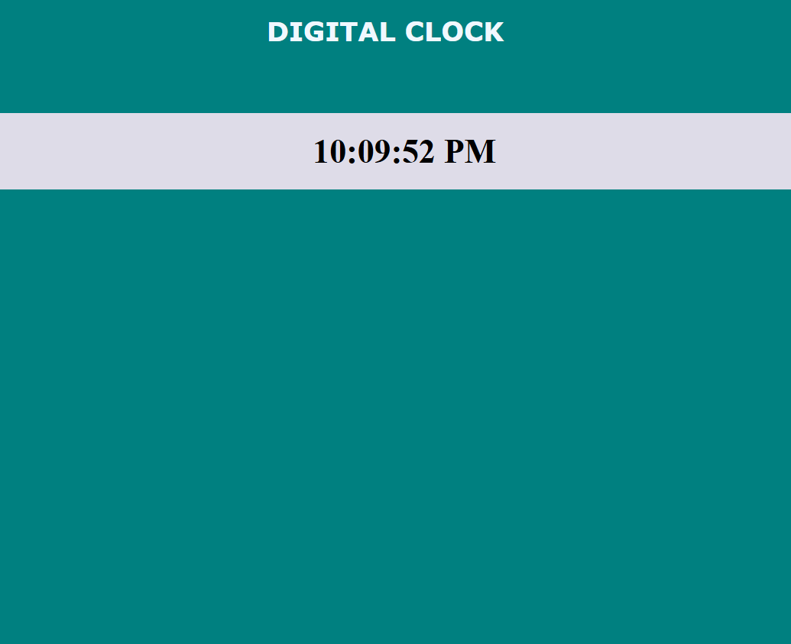

# 🕰️ Digital Clock (React)

A simple React application that displays the current time in a digital clock format, updating in real-time. This beginner-friendly project demonstrates the use of **React Hooks (`useState`, `useEffect`)**.

## 📌 Features
- ✅ **Live Time Update**: The time updates every second.
- ✅ **Minimalist UI**: Clean and simple design.
- ✅ **Beginner-Friendly**: Uses basic React concepts (`useState`, `useEffect`).
- ✅ **Custom Styling**: Styled using CSS.

## 🛠️ Technologies Used
- ⚛️ **React** (useState and useEffect Hooks for state management and time updates)
- 💻 **JavaScript** (ES6+ features for clean and efficient code)
- 🎨 **CSS** (for a stylish and minimal design)
- 📄 **HTML** (for structured content)

## 🚀 Live Demo
To see it in action, clone the repository and follow the setup instructions below.

## 🚀 Getting Started

1. **Clone the repository:**
   
   git clone https://github.com/Eshhaa11/digital-clock

2. **Navigate to the project directory:**
 
   cd digital-clock

3. **Install dependencies:**

   npm install

4. **Start the development server:**

    npm start

5. **Open your browser and visit: http://localhost:3000**

 ## 🎨 Screenshots:
 

## 🤝 Contributing
Excited to improve this project? Fork the repository, create a feature branch, and open a pull request. Every contribution helps make it better! 🚀✨

🎉 Happy Coding! 🚀
